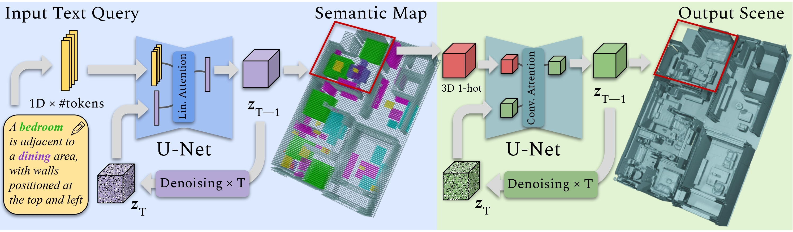

# SceneFactor: Factored Latent 3D Diffusion for Controllable 3D Scene Generation
### [Project Page](https://alexeybokhovkin.github.io/scenefactor/) | [Paper](http://arxiv.org/abs/2412.01801) | [Video](https://youtu.be/wZqX09IFveA)

Official PyTorch implementation of the paper


We present SceneFactor, a diffusion-based approach for large-scale 3D scene generation that enables controllable generation and effortless editing.

SceneFactor enables text-guided 3D scene synthesis through our factored diffusion formulation, leveraging latent semantic and geometric manifolds for generation of arbitrary-sized 3D scenes. While text input enables easy, controllable generation, text guidance remains imprecise for intuitive, localized editing and manipulation of the generated 3D scenes.

Our factored semantic diffusion generates a proxy semantic space composed of semantic 3D boxes that enables controllable editing of generated scenes by adding, removing, changing the size of the semantic 3D proxy boxes that guides high-fidelity, consistent 3D geometric editing. Extensive experiments demonstrate that our approach enables high-fidelity 3D scene synthesis with effective controllable editing through our factored diffusion approach.

<br>

https://github.com/user-attachments/assets/ca466d81-c6a4-4975-a768-bbe23be71e27


## Method Overview




## Dependencies

For our project we used CUDA 11.7, PyTorch 1.13.0 and PyTorch Lightning 1.8.0. We attach our Conda environment file, so it can be installed using:
```commandline
conda env create -f environment.yml
```

Moreover, [Manifold](https://github.com/hjwdzh/Manifold), [ManifoldPlus](https://github.com/hjwdzh/ManifoldPlus) are required for data processing.

Finally, install the following packages:

```commandline
pip install mesh2sdf
pip install transformers
pip install einops
pip install rotary-embedding-torch
pip install prettytable
```


## Data preparation

Our method uses 3D-FRONT and 3D-FUTURE datasets, which are combined together and processed into chunks equipped with captions. Download these datasets before launching the following data processing scripts.

### Initial 3D-FUTURE and 3D-FRONT processing

1. Provide paths to 3D-FUTURE dataset in ```data_processing/store_manifold_3dfuture.py```. Run bash script ```data_processing/store_manifold_3dfuture.sh``` with Slurm or modify to run with bash. This script processes 3D-FUTURE meshes with Manifold to fix non-manifold meshes.

2. [Optional but preferred] Provide paths to 3D-FUTURE dataset in ```data_processing/fix_3dfuture_meshes.py```. Run bash script ```data_processing/fix_3dfuture_meshes.sh``` with Slurm or modify to run with bash. This script simplifies particular 3D-FUTURE meshes and fills holes inside them.

3. Provide paths to 3D-FUTURE (after steps 1 and 2) and 3D-FRONT datasets in ```data_processin/store_3dfuturefront.py```. Run bash script ```data_processing/store_3dfuturefront.sh``` with Slurm or modify to run with bash. This script assembles 3D-FRONT and processed 3D-FUTURE datasets and stores final mesh geometry per scene.

### Training/inference geometrical data processing

4. Provide a path to the processed 3D-FRONT dataset (after step 3) in ```data_processing/compute_sdf_3dfront.py```. Run bash script ```data_processing/compute_sdf_3dfront.sh``` with Slurm or modify to run with bash. This script stores processed 3D-FRONT dataset in SDF voxel format split into chunks.

5. Provide a path to the SDF voxel 3D-FRONT dataset (after step 4) in ```data_processing/compute_train_chunks_vox_lowres_2x2_sem.py```. Run bash script ```data_processing/compute_train_chunks_vox_lowres_2x2_sem.sh``` with Slurm or modify to run with bash. This script randomly samples chunks from the 3D-FRONT data processed in the previous step for training geometric and semantic VQ-VAEs.

6. Provide a path to the processed 3D-FRONT dataset (after step 3) in ```data_processing/compute_inference_chunks.py```. Run bash script ```data_processing/compute_inference_chunks.sh``` with Slurm or modify to run with bash. This script produces chunks per scene for testing/inference.

### Training/inference text data processing

7. Provide paths to the processed 3D-FRONT dataset (after step 3), to 3D-FRONT metadata folder and to chunks folder that is produced for training (after step 5) or inference (after step 6) in ```data_processing/compute_captions.py```. Run bash script ```data_processing/compute_captions.sh``` with Slurm or modify to run with bash. This script computes simple synthetic captions for training and inference chunks.

8. Provide paths to the processed 3D-FRONT dataset (after step 3), to 3D-FRONT metadata folder and to chunks folder that is produced for training (after step 5) or inference (after step 6) in ```data_processing/compute_captions_spatial.py```. Run bash script ```data_processing/compute_captions_spatial.sh``` with Slurm or modify to run with bash. This script computes synthetic captions with spatial relations for training and inference chunks.

9. Provide a path to chunks folder that is produced for training (after step 5) or inference (after step 6) in ```data_processing/compute_all_captions_qwen_train.py```. Run bash script ```data_processing/compute_all_captions_qwen_train.sh``` with Slurm or modify to run with bash. This script computes more natural Qwen1.4 versions of captions produced in the steps 7 and 8.


## Training & Experiments

Training pipeline consists of 4 steps. First, we train two autoencoders to compress geometric and semantic data into 3D latent grids. After that we train semantic and geometric diffusion models on top of this latent manifold. For inference, our method allows for per-chunk and large-scale scene synthesis. For every stage -- VQ-VAE models training / inference, diffusion models training / inference -- it is required to create an experiment folder, put a corresponding ```specs.json``` file (similar to files in ```configs```) to the folder and provide a path to this folder into a corresponding launching script.

### Training semantic and geometric VQ-VAEs

1. Use ```configs/specs_sem_vqvae.json``` to train semantic VQ-VAE model that compresses coarse semantic maps into latent grids. Then launch with Slurm or modify to launch with bash:
```commandline
sbatch train_modulation.sh
```
Specify ```-e <path to the experiment folder containing specs.json> -b <batch size> -w <number of workers>``` in ```train_modulation.sh```.

2. Use ```configs/specs_geo_vqvae_onestage.json``` to train geometric VQ-VAE model that compresses SDF chunk grids into latent grids. Then launch with Slurm or modify to launch with bash:
```commandline
sbatch train_modulation.sh
```
Specify ```-e <path to the experiment folder containing specs.json> -b <batch size> -w <number of workers>``` in ```train_modulation.sh```.

#### Alternative geometric VQ-VAE training

2a. Use ```configs/specs_geo_vqvae_stage1.json``` to train the first geometric VQ-VAE model that compresses high-resolution SDF chunk grids into low-resolution latent grids. Then launch with Slurm or modify to launch with bash:
```commandline
sbatch train_modulation.sh
```
Specify ```-e <path to the experiment folder containing specs.json> -b <batch size> -w <number of workers>``` in ```train_modulation.sh```.

2b. After that, use ```configs/specs_geo_vqvae_stage2.json``` to train the second geometric VQ-VAE model that compresses high-resolution SDF chunk grids into high-resolution latent grids. Then launch with Slurm or modify to launch with bash:
```commandline
sbatch train_modulation.sh
```
Specify ```-e <path to the experiment folder containing specs.json> -b <batch size> -w <number of workers>``` in ```train_modulation.sh```.

### Training semantic and geometric diffusion models

3. Use ```configs/specs_sem_diff.json``` to train semantic diffusion model. Then launch with Slurm or modify to launch with bash:
```commandline
sbatch train_diffusion_ddp.sh
```
Specify ```-e <path to the experiment folder containing specs.json> -b <batch size> -w <number of workers> -r <optionally checkpoint epoch number>``` in ```train_diffusion_ddp.sh```.

4. Use ```configs/specs_geo_diff_onestage.json``` to train geometric diffusion model. Then launch with Slurm or modify to launch with bash:
```commandline
sbatch train_diffusion_ddp.sh
```
Specify ```-e <path to the experiment folder containing specs.json> -b <batch size> -w <number of workers> -r <optionally checkpoint epoch number>``` in ```train_diffusion_ddp.sh```.

#### Alternative geometric diffusion training (if used steps 1a/1b)

4a. Use ```configs/specs_geo_diff_stage1.json``` to train the first geometric diffusion model. Then launch with Slurm or modify to launch with bash:
```commandline
sbatch train_diffusion_ddp.sh
```
Specify ```-e <path to the experiment folder containing specs.json> -b <batch size> -w <number of workers> -r <optionally checkpoint epoch number>``` in ```train_diffusion_ddp.sh```.

4b. After that, use ```configs/specs_geo_diff_stage2.json``` to train the second geometric diffusion model. Then launch with Slurm or modify to launch with bash:
```commandline
sbatch train_diffusion_ddp.sh
```
Specify ```-e <path to the experiment folder containing specs.json> -b <batch size> -w <number of workers> -r <optionally checkpoint epoch number>``` in ```train_diffusion_ddp.sh```.

### Scene chunk generation

5. Use ```configs/specs_sem_infer.json``` which specifies a folder with a trained semantic VQ-VAE model and a folder with a trained corresponding semantic diffusion model to launch inference of coarse semantic chunks from text input. Then launch with Slurm or modify to launch with bash:
```commandline
sbatch inference_separate_sem.sh
```
Specify ```-e <path to the experiment folder containing specs.json> -s <optional split index if inference in parallel> -d <folder to save generations>``` in ```inference_separate_sem.sh```.

6. Use ```configs/specs_geo_infer_stage1_onestage.json``` which specifies a folder with a trained geometric VQ-VAE model, a folder with a trained corresponding geometric diffusion model and a folder with generated semantic chunks to launch inference of geometric chunks. Then launch with Slurm or modify to launch with bash:
```commandline
sbatch inference_separate_geo.sh
```
Specify ```-e <path to the experiment folder containing specs.json> -d <folder with generated semantic chunks> -s <folder to save generations> -n <number of processes (GPUs) for chunks generation> -p <process id>``` in ```inference_separate_geo.sh```.

#### Alternative geometric diffusion generation (if used steps 4a/4b)

6a. Use ```configs/specs_geo_infer_stage1_onestage.json``` which specifies a folder with a trained geometric VQ-VAE model, a folder with a trained corresponding geometric diffusion model and a folder with generated semantic chunks to launch inference of geometric chunks. Then launch with Slurm or modify to launch with bash:
```commandline
sbatch inference_separate_geo.sh
```
Specify ```-e <path to the experiment folder containing specs.json> -d <folder with generated semantic chunks> -s <folder to save generations> -n <number of processes (GPUs) for chunks generation> -p <process id>``` in ```inference_separate_geo.sh```.

6b. Use ```configs/specs_geo_infer_stage2.json``` which specifies a folder with a trained geometric VQ-VAE model, a folder with a trained corresponding refining geometric diffusion model and a folder with generated geometric chunks to launch inference of refined geometric chunks. Then launch with Slurm or modify to launch with bash:
```commandline
sbatch inference_separate_geo_stage2.sh
```
Specify ```-e <path to the experiment folder containing specs.json> -d <folder with generated geometric chunks> -n <number of processes (GPUs) for chunks generation> -p <process id>``` in ```inference_separate_geo_stage2.sh```.

### Large-scale scene generation

7. Use ```configs/specs_sem_infer.json``` which specifies a folder with a trained semantic VQ-VAE model and a folder with a trained corresponding semantic diffusion model to launch inference of coarse semantic scenes from text input (per chunk). Then launch with Slurm or modify to launch with bash:
```commandline
sbatch inference_text_to_sem.sh
```
Specify ```-e <path to the experiment folder containing specs.json> -c <path to JSON with mapping from scene id to caption type> -s <folder to save generations> -n <number of processes (GPUs) for chunks generation> -p <process id>``` in ```inference_text_to_sem.sh```.

8. Use ```configs/specs_geo_infer_stage1_onestage.json``` which specifies a folder with a trained geometric VQ-VAE model, a folder with a trained corresponding geometric diffusion model and a folder with generated semantic scenes to launch inference of geometric scenes. Then launch with Slurm or modify to launch with bash:
```commandline
sbatch inference_sem_to_geo_overlap_stage1_onestage.sh
```
Specify ```-e <path to the experiment folder containing specs.json> -s <folder to save generations> -t <path to a .txt file with scene ids to process> -n <number of processes (GPUs) for chunks generation> -p <process id>``` in ```inference_sem_to_geo_overlap_stage1_onestage.sh```.

#### Alternative geometric diffusion generation (if used steps 6a/6b)

8a. Use ```configs/specs_geo_infer_stage1_onestage.json``` which specifies a folder with a trained geometric VQ-VAE model, a folder with a trained corresponding geometric diffusion model and a folder with generated semantic scenes to launch inference of geometric scenes. Then launch with Slurm or modify to launch with bash:
```commandline
sbatch inference_sem_to_geo_overlap_stage1_onestage.sh
```
Specify ```-e <path to the experiment folder containing specs.json> -s <folder to save generations> -t <path to a .txt file with scene ids to process> -n <number of processes (GPUs) for chunks generation> -p <process id>``` in ```inference_sem_to_geo_overlap_stage1_onestage.sh```.

8b. Use ```configs/specs_geo_infer_stage2.json``` which specifies a folder with a trained geometric VQ-VAE model, a folder with a trained corresponding refining geometric diffusion model and a folder with generated geometric scenes to launch inference of refined geometric scenes. Then launch with Slurm or modify to launch with bash:
```commandline
sbatch inference_sem_to_geo_nooverlap_stage2.sh
```
Specify ```-e <path to the experiment folder containing specs.json> -s <folder to save generations> -n <number of processes (GPUs) for chunks generation> -p <process id>``` in ```inference_sem_to_geo_nooverlap_stage2.sh```.

### Editing experiments

9. Use ```configs/specs_geo_infer_stage1_onestage.json``` which specifies a folder with a trained geometric VQ-VAE model, a folder with a trained corresponding refining geometric diffusion model and a folder with generated geometric scenes to launch inference of refined geometric scenes. Then launch with Slurm or modify to launch with bash:
```commandline
sbatch inference_sem_to_geo_overlap_edit_stage1_onestage.sh
```
Before editing execute steps 7, 8 to generate semantic and geometric scenes. Editing inference requires a folder ```edit_scenes_folder``` with subfolders corresponding to a combination of a scene and editing operation (addition / removal / replacement / displacement / size change). Every subfolder should contain ```full_sem.npy``` (original semantic map of a scene), ```full_sem_edited.npy``` (edited semantic map of a scene), ```full_sem_edited.json``` (editing operation annotation specifying editing coords), ```full_lowres_latent.npy``` (original geometric 3D latent grid). Specify ```-e <path to the experiment folder containing specs.json> -d <directory with scenes to edit, where every scene contains orig. sem. map, edited sem. map, editing annotation, orig. geom. lat. grid> -k <save index for every scene>``` in ```inference_sem_to_geo_overlap_edit_stage1_onestage.sh```.

#### Alternative editing (if used steps 8a/8b)

9a. Use ```configs/specs_geo_infer_stage1_onestage.json``` which specifies a folder with a trained geometric VQ-VAE model and a folder with a trained corresponding refining geometric diffusion model. Then launch with Slurm or modify to launch with bash:
```commandline
sbatch inference_sem_to_geo_overlap_edit_stage1_onestage.sh
```
Before editing execute steps 7, 8a, 8b to generate semantic and geometric scenes. Editing inference requires a folder ```edit_scenes_folder``` (similar to step 9). Specify ```-e <path to the experiment folder containing specs.json> -d <directory with scenes to edit, where every scene contains orig. sem. map, edited sem. map, editing annotation, orig. geom. lat. grid> -k <save index for every scene>``` in ```inference_sem_to_geo_overlap_edit_stage1_onestage.sh```.

9b. Use ```configs/specs_geo_infer_stage2.json``` which specifies a folder with a trained geometric VQ-VAE model and a folder with a trained corresponding refining geometric diffusion model. Then launch with Slurm or modify to launch with bash:
```commandline
sbatch inference_sem_to_geo_nooverlap_edit_stage2.sh
```
Before editing execute steps 7, 8a, 8b, 9a to generate semantic and geometric scenes and edit the first geometric map. Editing inference requires a folder ```edit_scenes_folder``` (similar to step 9a). Every subfolder should contain ```full_lowres_latent.npy``` (original geometric 3D latent grid before refinement, to use as condition), ```full_room_latent_lowres_edited.npy``` (edited geometric 3D latent grid, after step 9a, to use as condition), ```full_sem_edited.json``` (editing operation annotation specifying editing coords), ```full_latent.npy``` (original geometric 3D latent grid of a refined scene). Specify ```-e <path to the experiment folder containing specs.json> -d <directory with scenes to edit, where every scene contains orig. sem. map, edited sem. map, editing annotation, orig. geom. lat. grid> -k <save index for every scene>``` in ```inference_sem_to_geo_nooverlap_edit_stage2.sh```.

9c. [Alternative to 9b] Use ```configs/specs_geo_infer_stage2.json``` which specifies a folder with a trained geometric VQ-VAE model and a folder with a trained corresponding refining geometric diffusion model. Then launch with Slurm or modify to launch with bash:
```commandline
sbatch inference_sem_to_geo_nooverlap_edit_stage2.sh
```
Before editing execute steps 7, 8a, 8b, 9a to generate semantic and geometric scenes and edit the first geometric map. Editing inference requires a folder ```edit_scenes_folder``` (similar to step 9b). This version is slower because it uses the sliding window option with overlaps. Specify ```-e <path to the experiment folder containing specs.json> -d <directory with scenes to edit, where every scene contains orig. sem. map, edited sem. map, editing annotation, orig. geom. lat. grid> -k <save index for every scene>``` in ```inference_sem_to_geo_nooverlap_edit_stage2.sh```.


## Checkpoints

Will be added soon!


## Citation
If you find our work useful in your research, please consider citing:

	@misc{bokhovkin2024scenefactor,
		title={SceneFactor: Factored Latent 3D Diffusion for Controllable 3D Scene Generation}, 
		author={Bokhovkin, Alexey and Meng, Quan and Tulsiani, Shubham and Dai, Angela},
		journal={arXiv preprint arXiv:2412.01801},
		year={2024}
	}