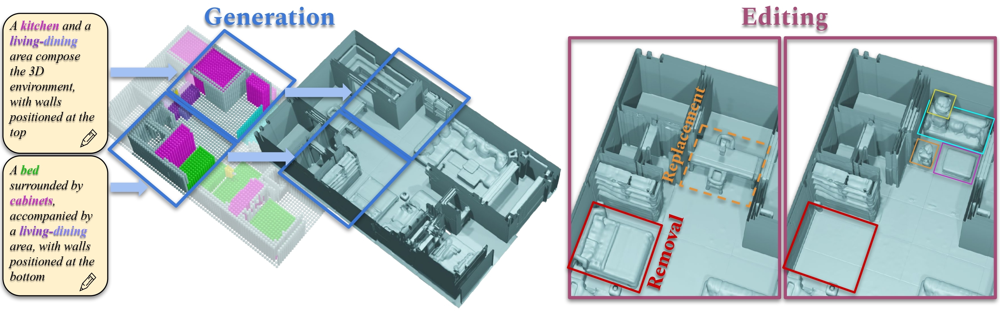

# SceneFactor: Factored Latent 3D Diffusion for Controllable 3D Scene Generation
### [Project Page](https://alexeybokhovkin.github.io/scenefactor/) | [Paper](http://arxiv.org/abs/XXX) | [Video](https://youtu.be/wZqX09IFveA)

Official PyTorch implementation of the paper

We present SceneFactor, a diffusion-based approach for large-scale 3D scene generation that enables controllable generation and effortless editing.

SceneFactor enables text-guided 3D scene synthesis through our factored diffusion formulation, leveraging latent semantic and geometric manifolds for generation of arbitrary-sized 3D scenes. While text input enables easy, controllable generation, text guidance remains imprecise for intuitive, localized editing and manipulation of the generated 3D scenes.

Our factored semantic diffusion generates a proxy semantic space composed of semantic 3D boxes that enables controllable editing of generated scenes by adding, removing, changing the size of the semantic 3D proxy boxes that guides high-fidelity, consistent 3D geometric editing. Extensive experiments demonstrate that our approach enables high-fidelity 3D scene synthesis with effective controllable editing through our factored diffusion approach.

 

### Source Code Coming Soon!

## Citation
If you find our work useful in your research, please consider citing:

	@misc{bokhovkin2024scenefactor,
		title={SceneFactor: Factored Latent 3D Diffusion for Controllable 3D Scene Generation}, 
		author={Bokhovkin, Alexey and Meng, Quan and Tulsiani, Shubham and Dai, Angela},
		journal={arXiv preprint arXiv:XXX},
		year={2024}
	}
